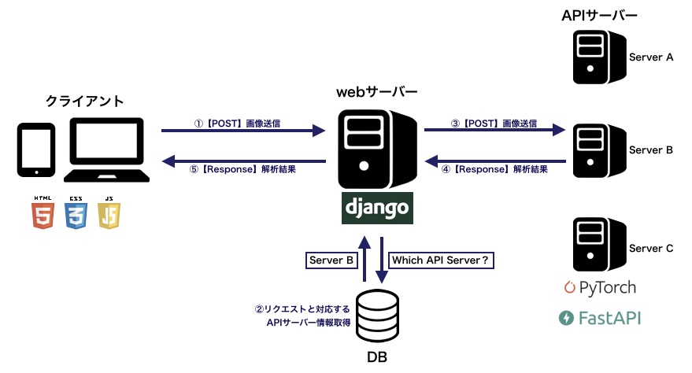

# AI webアプリ  
* 画像をAIで解析し、結果を表示するwebアプリ  
* デモを下記で公開中  
  [http://kassii.xyz/ai_demo/project/](http://kassii.xyz/ai_demo/project/)

## システム構成  
* 1つのwebサーバーと複数のAPIサーバーで構成される  
* webサーバーはクライアントから送信された画像を対応するAPIサーバーへ渡し、APIの解析結果をクライアントへ返す  
* APIサーバーはHTTPリクエストが来たらAI解析をして結果を即時返す（オンライン予測）  


## フォルダ構成  
```
./
├─ UI/ ................... webサーバーのスクリプト（Djangoプロジェクト）  
├─ ClassificationAPI ..... 分類AIのサンプルAPI  
│  └─ main.py ............ FastAPIで実装したAPI本体スクリプト  
├─ DetectionAPI .......... 物体検出AIのサンプルAPI  
│  └─ main.py ............ FastAPIで実装したAPI本体スクリプト  
└─ SegmentationAPI ....... セグメンテーションAIのサンプルAPI  
   └─ main.py ............ FastAPIで実装したAPI本体スクリプト  
```

## 環境構築  
* webサーバーの環境構築  
1. 下記のコマンドを実行  
   `> pip install -r requirements_ui.txt`  

* APIサーバーの環境構築  
1. 下記のコマンドでpytorchをインストール  
   ```
   # CPUの場合  
   pip install torch==1.8.1 torchvision==0.9.1  

   # GPUの場合  
   pip install torch==1.8.1+cu111 torchvision==0.9.1+cu111 -f https://download.pytorch.org/whl/lts/1.8/torch_lts.html  
   ```

2. 下記のコマンドを実行  
   `> pip install -r requirements_api.txt`  


## 実行方法  
> **注意**  
> ここではローカル環境での動作を想定した方法を記載する。具体的には下記の条件を想定。  
> * webサーバーとAPIサーバーは同一マシン内に起動させる  
> * webサーバーはDjangoに搭載されている開発用サーバーで起動させる  
> * APIサーバーはuvicornでlocalhostの適当なポートに起動させる  
> 
> 本番環境で動作させる場合は別途webサーバーやWSGIサーバーの設定を行う。  
>

1. webサーバーを起動する  
   `> cd UI`  
   `> python manage.py runserver`  

2. APIサーバーを起動する（webサーバーを起動した端末とは別な端末で実行）  
   それぞれのAPI毎に別な端末で実行  
   * Classification API  
   `> cd ClassificationAPI`  
   `> uvicorn main:app --reload --port 8001`  

   * Detection API  
   `> cd DetectionAPI`  
   `> uvicorn main:app --reload --port 8002`  

   * Segmentation API  
   `> cd SegmentationAPI`  
   `> uvicorn main:app --reload --port 8003`  

3. ブラウザで[http://127.0.0.1:8000/ai_demo/project](http://127.0.0.1:8000/ai_demo/project)にアクセス  

4. 終了するときは全ての端末でCtr+Cを実行してサーバーを停止させる  

## APIの追加方法  
* 自作AIをAPI化して追加で登録することも可能  
* 対応しているAIタスクは下記の通り  
    * 分類  
    * 物体検出  
    * セグメンテーション  

### APIの実装  
* 各タスクのAPI仕様を満たすように実装する  
* 詳細な仕様は各サンプルAPIのREADMEを参照  

### 新規APIの登録  
1. webサーバーを起動する  
2. 管理画面（[http://127.0.0.1:8000/admin](http://127.0.0.1:8000/admin)）へアクセス  
   本リポジトリのスクリプトはデフォルトで下記の管理ユーザーが登録されている  
   ユーザー名：admin  
   パスワード：admin  
3. projectをクリックして「PROJECTを追加」ボタンをクリック  
4. 新規実装したAPIの情報を登録する  
     Name：任意のAPI名（一覧ページ、詳細ページのタイトルに表示される）  
     Description：APIの説明（詳細ページのタイトルの下に表示される）  
     Task type：AIのタスクの種類
     Api url：APIのURI
